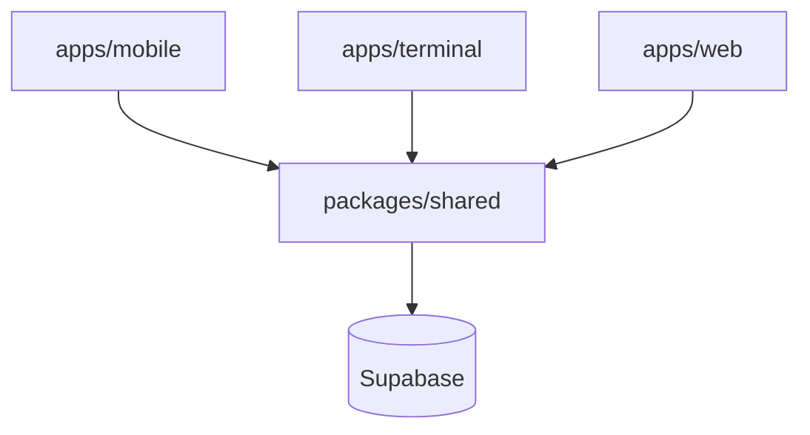
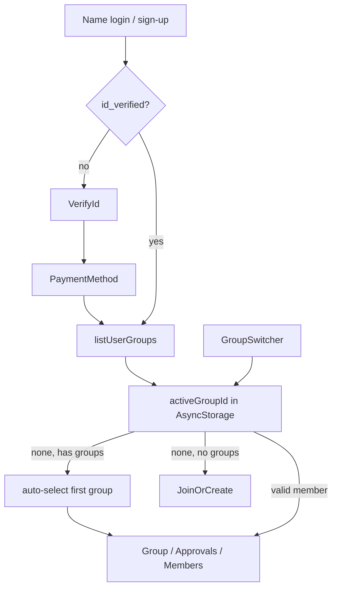

# Architecture

See also the product checklist in [plan.md](plan.md).

## Monorepo

| Package / app | Role |
|---------------|------|
| `packages/shared` | Types, env validation, Supabase client, realtime helpers, service layer |
| `apps/mobile` | Expo Router consumer app |
| `apps/terminal` | Vite merchant terminal |
| `apps/web` | Marketing landing |

There is **no custom Node API**. Supabase Auth + PostgREST + Realtime implement server behavior.

## docs/plan.md coverage

| Feature | Status in groundwork |
|---------|----------------------|
| group ↔ people M:N | `group_members` |
| group → transactions | `transactions` |
| group → virtual card | `virtual_cards` |
| person card info | `payment_methods` |
| person legal / ID | `users` + `verify-id` screen |
| transaction participant subset | `transaction_participants` |
| API: user / group / join / transaction | `packages/shared/src/services/*` |
| Create account | `login` — name → email `@grouppay.demo` + demo password |
| Verify ID | `verify-id` |
| Create / join group | `group/create`, `group/join` |
| Spend / approve | terminal + `approvals` tab |
| Group view | `group/index` |
| Landing site | `apps/web` |

## Mobile navigation

**Multi-group:** memberships live in `group_members`; only `activeGroupId` (local) chooses which group the UI loads. Creating a group does not remove other memberships.

**Approvals “notifications”:** `usePendingApprovals` subscribes to realtime `transactions` inserts/updates; tab badge shows pending count. Push notifications are a later addition.

## Realtime

Enabled tables: `transactions`, `transaction_approvals`, `transaction_participants`, `virtual_cards`.

Helpers live in `packages/shared/src/supabase/realtime.ts`.

## Extension points

- Approval quorum and card status updates → `services/transactions.ts` + DB triggers (later)
- Production RLS → new migration tightening policies
- Type codegen → `supabase gen types typescript`
