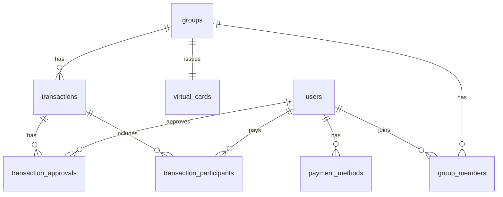

# Database

Schema defined in `supabase/migrations/` (latest includes virtual cards).

## ER overview

## Tables

### `users`
Profile row per `auth.users`. Legal fields are **demo KYC stubs** only.

| Column | Type | Notes |
|--------|------|-------|
| id | uuid PK | FK → auth.users |
| login_name | citext unique | Demo login key (case-insensitive) |
| display_name | text | |
| legal_name | text | From ID verification |
| date_of_birth | date | |
| id_document_last4 | text | Simulated ID reference |
| id_verified | boolean | Gate for main app |
| id_verified_at | timestamptz | |

### `payment_methods`
Simulated saved cards for demo KYC onboarding. **`pan`** holds the full card number in this hackathon build (same pattern as `virtual_cards.pan`) — **not PCI-compliant**; do not use in production.

### `groups`
| Column | Notes |
|--------|-------|
| invite_code | Unique 6-char code for joining |
| approval_threshold | Approvals needed (logic TBD) |

### `virtual_cards`
One virtual debit card per group for the pay-as-you-go flow.

| Column | Notes |
|--------|-------|
| group_id | Unique FK → groups |
| pan | Full card number (demo only) |
| exp_month | Expiry month |
| exp_year | Expiry year |
| status | `active` or `paused` |

### `group_members`
M:N between users and groups. `role`: `admin` | `member`.

### `transactions`
| status | Meaning |
|--------|---------|
| pending | Awaiting approvals |
| approved | Enough approvals (future) |
| rejected | Declined |
| completed | Settled (future) |

### `transaction_participants`
**Subset of group members** who pay for this transaction (e.g. skipped a meal).

Optional `share_cents` for per-person splits (equal split logic later).

### `transaction_approvals`
One row per user per transaction. Upserted on approve/decline.

## Approval rule (default for demo)

Documented default: only users in `transaction_participants` should approve; `approval_threshold` applies to that set. **Quorum enforcement is not implemented in groundwork** — UI records approvals only.

## RLS

Permissive policies for `authenticated` on all tables (hackathon demo). Tighten before any real deployment.

## Realtime publication

- `transactions`
- `transaction_approvals`
- `transaction_participants`
- `virtual_cards`

## Service layer

Apps should call `packages/shared/src/services/*` instead of ad-hoc queries. This is the extension point for card status updates and quorum logic.
